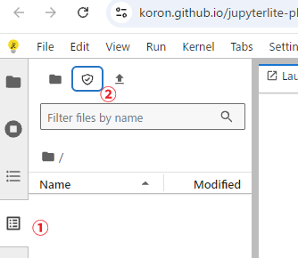
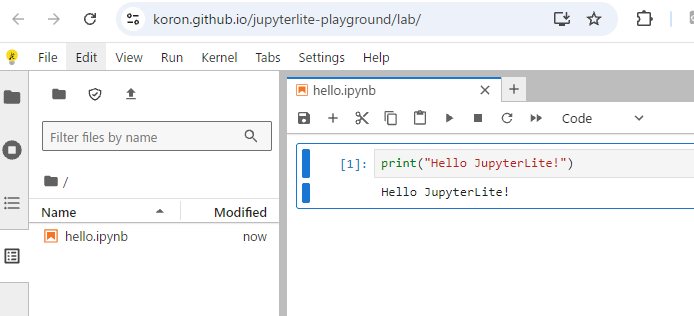
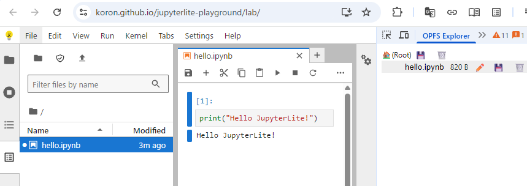

# JupyterLite で OPFS を使う

[JupyterLite][jlite]から[OPFS](https://developer.mozilla.org/ja/docs/Web/API/File_System_API/Origin_private_file_system)へアクセスできるようにした。
加えてJupyterLiteのいくつかの利用(主にビルド・デプロイ)方法を紹介する。

[jlite]:https://jupyterlite.readthedocs.io/en/latest/index.html
[jlab]:https://jupyter.org/

## 前置き

[JupyterLite][jlite]は、インタラクティブな開発環境である[JupyterLab][jlab]のブラウザ完結版。
わかってる人からは「いやJupyterLabはもともとブラウザで動くよね」というツッコミがあると思う。
でもJupyterLiteはほんとにブラウザで完結してて、つまりカーネルもPyodideというCPythonのWASMポートがブラウザ上で実行される。
だからコード実行もブラウザ内で完結してる。

JupyterLiteの利点は動的なサーバーが要らず、静的コンテンツのみでホストできること。
Jekyllみたいなもので、一度ビルドしてしまえばHTTPファイルサーバーでホストできるから、管理の手間が圧倒的に少ない。
実際に[GitHubにあるテンプレートレポジトリ](https://github.com/jupyterlite/demo)から `Use this template` を押すだけで、
レポジトリをクローンしてGitHub Actionsが自動でビルドしGitHub Pagesがホストする、自分のJupyterLiteインスタンスが立ち上がる。
([詳細](https://jupyterlite.readthedocs.io/en/latest/quickstart/deploy.html))

JupyterLiteがどういうモノかは、言葉であれこれ説明するよりも [デモサイト](<https://jupyterlite.readthedocs.io/en/latest/_static/lab/index.html>) を実際に触ってもらった方が良いだろう。

さて逆にJupyterLiteの弱点は、デフォルトのファイルシステムに制限があり、通常は最大5MB程度しか保存できないことがあげられる。
これはJupyterLiteが[ローカルストレージ](https://developer.mozilla.org/ja/docs/Web/API/Storage_API/Storage_quotas_and_eviction_criteria#%E3%82%A6%E3%82%A7%E3%83%96%E3%82%B9%E3%83%88%E3%83%AC%E3%83%BC%E3%82%B8)により実装されていることに拠る。
[jupyterlab-filesystem-access](https://github.com/jupyterlab-contrib/jupyterlab-filesystem-access/)という拡張をインストールすればローカルなファイルシステムにアクセスできるようになるが、
起動というかページロードのたびにアクセスを許可するフォルダを選ぶところから始めることになるので、若干煩わしい。

そこで本題であるところのJupyterLiteでOPFSを使うという話に繋がってくる。
OPFSとは Origin Private File System の略で、文字通りオリジン≒ホストとポートの組ごとに独立したファイルシステムがブラウザによって割り当てられる、というものだ。
このOPFSのサイズ制限は特に設定していなければ使ってるディスクの制限に準拠し、ローカルストレージのような制限がない。
またWebアプリケーションがOPFSにアクセスするにあたりユーザーの許可も必要なく、面倒がない。
加えてOPFSはオリジンを跨いでアクセスできないので、
あるサイトのアプリが使うOPFSは別のサイトのアプリからは絶対にアクセスできないという感じで、セキュアだというのが最大のポイント。
近年はこの制限が緩く利便性が高く安全なOPFSを、
Webアプリケーションの大き目なデータの置き場に利用するという動きがある。

今回、僕は jupyterlab-filesystem-access 拡張を改造して OPFS にもアクセスできるようにした。

## 実践

前置きが長くなってしまったが、いよいよ実際に JupyterLite から OPFS へアクセスするのを試してみよう。

### ビルド済みサイト

一番簡単に試すには、僕が設定したビルド済みサイトにアクセスするのが良いだろう。URLは以下の通り。

<https://koron.github.io/jupyterlite-playground/lab/>

見慣れたJupyterLabの画面が出てくるだろう。
その画面内から下記の図で示すように、
左のツールバーから図中の① Local File System を選択し、
次に表示されたタブの一番上から図中の②の「盾」のようなボタン(Open the Origin Private File System)をクリックするとOPFSが選択されたことになる。
初期状態ではOPFS内は空なので一見OPFSが開けたかはわからないことに注意して。



ここで適当なファイル、Pythonのノートブックを作って保存してみよう。
普通にJupyterLabとして利用できることがわかる。
以下の図は `hello.ipynb` というノートブックをOPFSに作成した様子だ。



ここからブラウザをリロードし、先ほどの手順で Local File System → Open the Origin Private File System を開くことで、
先ほどの `hello.ipynb` がどこかしらに保存されていることが確認できる。
もちろん保存先はOPFSだ。

OPFSに保存されていることを確認する最も簡単な方法は、
Chromeの[OPFS Explorer拡張](https://chromewebstore.google.com/detail/opfs-explorer/acndjpgkpaclldomagafnognkcgjignd?hl=ja)をインストールすることだ。
この拡張をインストールすると、リロードか再起動が必要かもしれないが、DevToolsに `OPFS Explorer` というタブが追加される。
で、そのタブを開いて確かに `hello.ipynb` というファイルが作成されたことを確認するのが以下の図となる。



### ビルド済みファイルを自分でデプロイ

先ほどのビルド済みサイトは静的コンテンツ、Github Pagesでただのファイル群だ。
つまりそれらのファイル群を自分の好きなところでホストすることができる。

ということで以下の zip ファイルもしくは .tar.gz ファイルをダウンロードし好きな場所へ展開した上で、
nginx でも Apache HTTP Server でも、はたまた `python -m http.server` でも好きな方法でホストし、試すことができる。

* <https://github.com/koron/jupyterlite-playground/releases/download/v0.0.1/jupyterlite-playground-0.0.1.zip>
* <https://github.com/koron/jupyterlite-playground/releases/download/v0.0.1/jupyterlite-playground-0.0.1.tar.gz>

ただしOPFSはセキュアコンテキストでしか利用できないので、
HTTPS もしくは localhost で使う必要がある。

以下は手っ取り早く localhost で試すためのコマンド例だ。

```console
$ mkdir jupyterlite+OPFS-test
$ cd jupyterlite+OPFS-test
$ curl -fsLO https://github.com/koron/jupyterlite-playground/releases/download/v0.0.1/jupyterlite-playground-0.0.1.tar.gz
$ mkdir site
$ tar xf jupyterlite-playground-0.0.1.tar.gz -C site
$ python -m http.server -d site 8001
```

この状態で <http://localhost:8001/> をブラウザで開けば、前節と全く同じことが試せる。

### 自分でサイトをビルド

次に自分で OPFSを使える JupyterLite のサイトをビルドしてみよう。

まずは
[Deploy your first JupyterLite website on GitHub Pages](https://jupyterlite.readthedocs.io/en/latest/quickstart/deploy.html)
の指示に従ってJupyterLiteのサイトを作成し、
そのソースコードをチェックアウトする。

```console
$ git clone git@github.coim:{your_account}/{your_project}.git
$ cd {your_project}
```

それから venv 環境を作って、有効化し、依存関係をインストールして、JupyterLite サイトをOPFS拡張無しでビルドする。

```console
$ python -m venv .venv
$ source .venv/bin/activate
$ python -m pip install -r requirements.txt
$ jupyter lite build --contents content --output-dir dist
```

これで dist/ ディレクトリにはビルドした JupyterLite サイト一式が格納されている。

ここで1つ寄り道を。
いちいち jupyter lite build に複数のオプションを渡すのはめんどくさいので、
それを回避するために設定ファイル `jupyter_lite_config.json` を以下のような内容で作ってしまおう。

```json
{
  "LiteBuildConfig": {
    "contents": [ "content" ],
    "output_dir": "dist"
  }
}
```

ここからOPFS拡張を追加するには2つの方法がある。1つは venv 環境にOPFS拡張の .whl をインストールしてしまう方法。
もう1つは extensions/ ディレクトリに .whl ファイルを配置してそれを使うように設定する方法。
いずれにせよ .whl を以下のURLから入手する必要がある。

<https://github.com/koron/jupyterlab-filesystem-access/releases/download/v0.6.0%2Bopfs/jupyterlab_filesystem_access-0.6.0+opfs-py3-none-any.whl>

ダウンロードのコマンド例は以下の通り。

```console
$ curl -fsLO https://github.com/koron/jupyterlab-filesystem-access/releases/download/v0.6.0%2Bopfs/jupyterlab_filesystem_access-0.6.0+opfs-py3-none-any.whl
```

#### オプション1: venv 環境へOPFS拡張をインストールする

venv 環境にOPFS拡張の .whl をインストールしてビルドするなら、以下のようにする。

```console
$ python -m pip install jupyterlab_filesystem_access-0.6.0+opfs-py3-none-any.whl
$ rm jupyterlab_filesystem_access-0.6.0+opfs-py3-none-any.whl

$ jupyter lite build
```

#### オプション2: extensions/ ディレクトリに配置する

extensions/ ディレクトリに .whl ファイルを配置してそれを使うように設定するなら、まず以下のようにする。

```console
$ mkdir extensions
$ mv jupyterlab_filesystem_access-0.6.0+opfs-py3-none-any.whl extensions/
```

次に先ほどの `jupyter_lite_config.json` を以下のように変更≒ `federated_extensions` の設定を追加する。

```json
{
  "LiteBuildConfig": {
    "contents": [ "content" ],
    "output_dir": "dist",
    "federated_extensions": [
      "extensions/jupyterlab_filesystem_access-0.6.0+opfs-py3-none-any.whl"
    ]
  }
}
```

あとは `jupyter lite build` でOK

この方法の利点は環境を汚染しなくて済むことなのだが、
そもそも venv を使っていればあまり気にしなくても良いのかもしれない。
ただ GitHub Actions でビルドして GitHub Pages にデプロイするには、
ビルド設定で拡張用の pip install をしなくてよいので手間が省ける。

## まとめ

ここまで JupyterLite + OPFS を使う方法を示してきた。

これと自作の [koron/nvgd](https://github.com/koron/nvgd) を組み合わせる、
すなわち同一オリジンで両方をホストすると OPFS を仲介として簡易な OLAP (Online Analytical Processing) ツールが構築できるのだが、
それはまた別のお話。

JupyterLite には JupyterLab の拡張の多くが利用できる。
このOPFS拡張に利用した jupyterlab-filesystem-access もそんな拡張の1つである。
拡張のビルドには [JupyterLab Extension開発入門](https://zenn.dev/d2c_mtech_blog/articles/ca66fd9296e7f7) を参考にした。
概ねこの記事通りにやればできるので、特に追加で解説することはない。

なおOPFS拡張は以下のレポジトリにソースがある。

<https://github.com/koron/jupyterlab-filesystem-access/tree/opfs-access>
