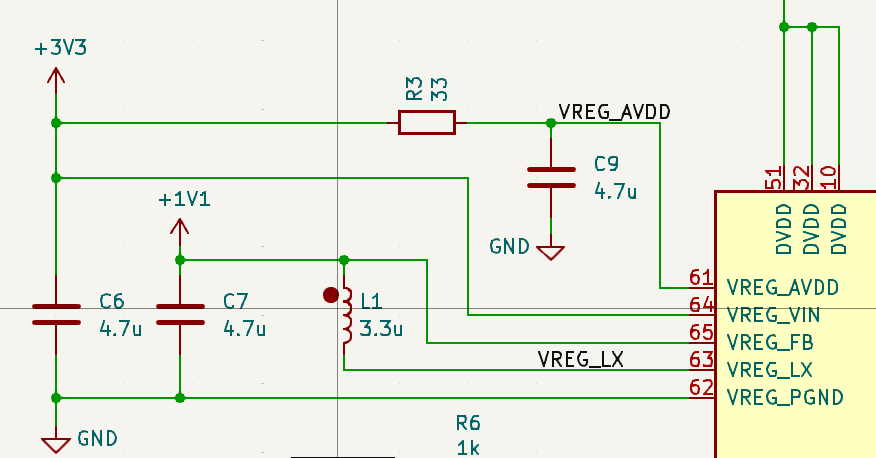
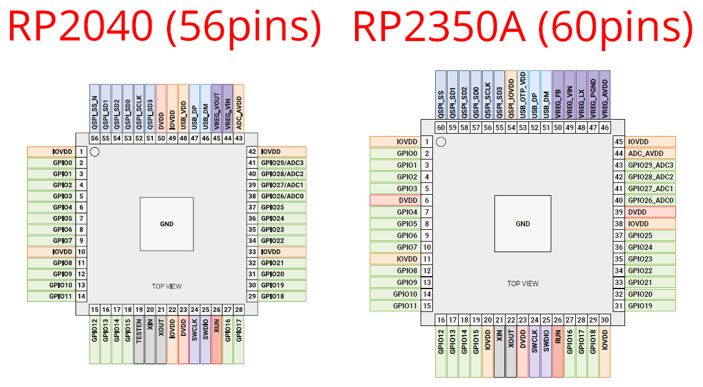
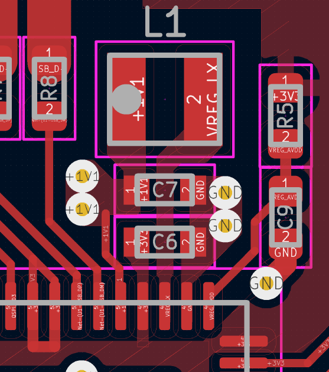
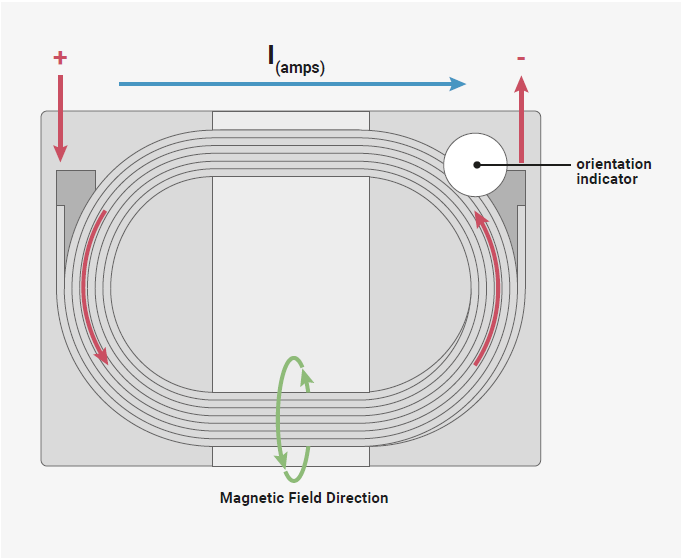

# RP2350 の調査

突如発表された RaspberryPi Pico 2 とそのMCUである RP2350 について。

<https://www.raspberrypi.com/products/rp2350/>

ドキュメント類:

* [データシート](https://datasheets.raspberrypi.com/rp2350/rp2350-datasheet.pdf)
* [ハードウェアデザインガイド](https://datasheets.raspberrypi.com/rp2350/hardware-design-with-rp2350.pdf)
* [プロダクト概要](https://datasheets.raspberrypi.com/rp2350/rp2350-product-brief.pdf)
* <https://www.raspberrypi.com/documentation/microcontrollers/silicon.html#rp2350>

RISC-V コアはオープンソースなハードウェア [Wren6991/Hazard3](https://github.com/Wren6991/Hazard3)。

> Our boot ROM can even auto-detect the architecture for which a second-stage binary has been built and reboot the chip into the appropriate mode.

[引用元](https://www.raspberrypi.com/documentation/microcontrollers/silicon.html#architecture-switching:~:text=Our%20boot%20ROM,appropriate%20mode)

焼かれているファームウェアからビルド時のアーキテクチャをブートロムで判断して、RISC-Vコアに切り替えるらしい。
RISC-Vコアにはセキュリティ機能と倍精度浮動小数点のアクセラレータが無い。

パッケージは4種類。GPIOが従来通りの30本か48本かの違い(A/B)と、チップ内に2MB Flashが内蔵されているかどうかの違い(50/54)。

名前の意味は以下の通り

* `RP` = Raspberry Pi
* `2` = Number of cores
* `3` = Type of core (e.g. Cortex-M33)
* `5` = `floor(log2(RAM / 16KB))`: 5 = 32x16KB = 512KB+
* `0` = `floor(log2(nonvolatile / 128KB))`: 4 = 16x128KB = 2MB+

セキュリティ機能の抜粋

* Signed boot support
* 8KB of on-chip antifuse one-time-programmable (OTP) memory: 鍵の保存用?
* SHA-256 acceleration
* A hardware true random number generator (TRNG)

[RP2350B のブレイクアウトボードのデザインファイル](https://datasheets.raspberrypi.com/pico/RPi-Pico-2-PUBLIC-20240708.zip)

VREG回りの新規回路

[USB PIDについて](https://www.raspberrypi.com/documentation/microcontrollers/silicon.html#usb-pids)

* 難しいことしないならRP2350の標準のVID=0x2E8AとPID? をセットし iManufacturer, iProduct, iSerial を指定する
* 独自ドライバが必要ならユニークなPIDが要るだろうね
* <https://github.com/raspberrypi/usb-pid> でPIDは管理されてる

## from Product brief

<https://datasheets.raspberrypi.com/rp2350/rp2350-product-brief.pdf>

RP2040とのピンアウトの比較

* 56 -> 60 pins に増えている
    * DVDD が左右に2か所増えた
    * 下方のTESTEN がなくなった
    * 下方にGPIO18が移動しIOVDDが増えた
    * ADC\_AVDD が右へ移動した
    * 上方のVREG関連が2本から+3して5本に
    * 上方から DVDD と IOVDD が減った
    * 上方にて QSPI\_IOVDD が増えた
        > Provides the IO supply for the chip’s QSPI interface
    * 上方にて USB\_VDD が USB\_OTP\_VDD に変わった
        > Power supply for internal USB full-speed PHY and OTP, nominal voltage 3.3 V

## from Hardware design guide

### +1.1V 内蔵レギュレーター

リファレンスボードのデザインの説明だが、自分でボードを設計する際の参考になる。

<https://datasheets.raspberrypi.com/rp2350/hardware-design-with-rp2350.pdf>

オンチップの+1.1V用レギュレーターが、その消費電力特性に合わせてリニアレギュレーターからスイッチングレギュレーターに変わった。
最大200mAまで引けるようになってる。

スイッチングなので、コイル(インダクタ)とコンデンサ(キャパシタ)により安定した直流にし、出力電圧のフィードバックを受けて狙った電圧に(比率を)調整する。

電源周りの回路はかなりタイトなので、リファレンスレイアウトから変える余地は少なそう。
インダクタの巻き向きにすらセンシティブ。
水晶と併せて部品型番すら指定したものでないと正常に動作しないかも(代える場合は自己責任)。

極性を示す0806(2016)のインダクタ 3.3uH を特注した。
これは一般向けに間もなく提供される。

電源周りに使用する部品のまとめは以下の通り。

* C6, C7 & C9 - 4.7μF (0402, 1005 metric)
* L1 - Abracon TBD (0806, 2016 metric)
* R3 - 33Ω (0402, 1005 metric)

5Vから3.3Vへの降圧はRP2040と同じで良い。
型番はNCP1117

レギュレーターから遠い場所(反対側)にあるデカップリングコンデンサは 100nF ではなく 4.7uF を推奨

### Flash

FlashはRP2040とほぼ一緒。例外は RP2354 シリーズでFlash内蔵の場合。
回路を省略するか、部品を未実装にすれば良い。

2つ目のFlashを積める。制御には場所が近いGPIO0が適している。

ブート時のFlashの読み取りには 03h シリアル読み取りが 1MHz で行われる。
ブートロムによるFlashプログラミング(例のUSBドライブモード)をサポートするには、Flash側に追加で以下のコマンドのサポートが必要。

* 02h 256-byte page program
* 05h status register read
* 06h set write enable latch
* 20h 4kB sector erase

Winbond W25Qシリーズを使ってればだいたい良いんじゃないかな?

FlashのXIPモードに注意。XIPモードではシリアルコマンドに応答しなくなるので、
RP2350がブートで使ってるシリアル読み取りができなくなる。
この状態はFlashデバイスの電源入れ直しが必要になる。
以下の固定コマンドでリセットを試みる。これはだいたい機能するが、機能しないこともある。

* CSn=1, IO[3:0]=4’b0000 (via pull downs to avoid contention), issue ×32 clocks
* CSn=0, IO[3:0]=4’b1111 (via pull ups to avoid contention), issue ×32 clocks
* CSn=1
* CSn=0, MOSI=1’b1 (driven low-Z, all other I/Os Hi-Z), issue ×16 clocks

### 水晶発振

外部クロックソースはなくても動くけど、安定のためにはあった方が良い。
クロックソースはXINに入れるCMOSか、XINとXOUTに12MHzの水晶発振子。

水晶発振子には ABM8-272-T3 を推奨。

* 周波数許容範囲 ±30ppm
* ESR 50Ω

    1KΩ と併せて +3.3V 駆動時の電流量を抑制する目的で設定されている。

        3.3V / 1050 Ω ≒ 0.00314... = 3mA

* 負荷容量 10pF

    サンプルではコンデンサ 15pF x2を繋いでる。
    水晶発振子からみて直列接続なので 7.5pF になる(計算式は省略)。
    回路自身の寄生容量を 3pF と仮定してメーカー推奨の 10pF に近い値にした。
    寄生容量を抑えるためトレースは短くした方が良い。

推奨は ABM8-272-T3 推奨 (大事なことなので2回…)

自分が以前RP2040のブレイクアウトボード作った時は [FA238V](https://www.epsondevice.com/crystal/ja/products/crystal-unit/fa238v.html) の 12MHz を使った。([販売店リンク](https://akizukidenshi.com/catalog/g/g105225/))。
特性は以下の通りなので周波数許容差的にちょっと足りない可能性がある。
あとESRがちょっと大きいけど、1KBと足せば 0.0029... でほぼ3mAか。

* 周波数許容差: ±50ppm
* 周波数温度特性: ±30ppm
* 負荷容量: 10pF
* 直列抵抗(ESR?): 100Ω

ABM8-272-T3は以下の DigiKey か Mouser での入手が容易か。

* <https://www.digikey.jp/ja/products/detail/abracon-llc/ABM8-272-T3/22472366>
* <https://www.mouser.jp/ProductDetail/ABRACON/ABM8-272-T3?qs=QpmGXVUTftEj6miOiJBMxQ%3D%3D>

秋月電子で買える、代替品になりそうなもの

* スルーホールの水晶発振子: <https://akizukidenshi.com/catalog/g/g108669/>
* 表面実装の水晶発振子: <https://akizukidenshi.com/catalog/g/g117134/>
* MEMS発振子: <https://akizukidenshi.com/catalog/g/g111093/>

    XINだけで行けるってことだろうけど、経年劣化を考えるとちょっと不安かな?

### I/O

USB D+/-には27Ωの抵抗が要る。RP2040と同じ。
USBを12Mbpsで動かすにはインピーダンスを90Ω近辺にする必要がある。
1mm厚のPCBで0.8mm幅のトラック0.15mmのギャップで、裏がベタGNDで約90Ωになる。
このパラメーターを変える場合、ちゃんと設計するか祈るからしい。
いずれにせよUSB FSは動くかもしれないが、USB標準に準拠することはない。

## from Datasheet

### System Bus

コアにAHB5があり、AHB5からAPBに繋がってる。
(2.1. Bus Fabric)

AHB5とAPBはARMが定めるバス規格

* AHB5 = Advanced High-Performance Bus 5
* APB = Advanced Peripheral Bus

### Processor Subsystem

SIO (Single-cycle IO subsystem) がセキュアと非セキュアで二重化されてる。
(3.1.1. Secure and Non-secure SIO)

RP2350ではCortex-M33 に幾つかのコプロセッサ(拡張)が追加されている。
コプロセッサは1サイクルごとに64ビットを転送できる、
プロセッサに密結合されたモジュールのこと。
(3.6. Cortex-M33 Coprocessors)

* GPIOコプロセッサ(GPIOC) GPIOの高速な読み書きができる
* DCP 倍精度浮動小数点演算 (Cのdouble)
* RCP 冗長コプロセッサ - セキュリティのためのもの
* FPU 浮動小数点ユニット (Cのfloat)

Core 0 をARM、Core 1 をRISC-Vのような混合アーキテクチャも、可能ではある。
(3.9.2. Mixed Archtecture Combinations)

### Memory

ブートROMが使う専用のブートRAMがある。
通常のRAMより遅く、またブートRAMからの命令実行はできない。
(4.3. Boot RAM)

8KBの一度だけ書き込み可能なストレージがある。
ストレージは初期値で0で、1度だけ1に変更できる。
(16ビット+8ビット) x 4096 の合計8KBになる。
データは16ビット、パリティに8ビット。
デバッグ無効化などの幾つかの重要なフラグがそこに含まれる。
(4.5. OTP)

### Bootrom

Flashを最大16個にパーティションできるようになった。
(5.1.2. Partition Table)

* 複数の実行可能イメージを保存する
* データ用のスペースを予約する
* セキュリティ属性を変える
* 異なるパーティションにUF2を書き込める

2つのパーティションをA/Bバージョニングのペアに設定すると、安全なバージョンアップの仕組みに利用できる。
BOOTSEL USBドライブはA/Bバージョニングペアを認識して、正しい方に書き込むので書き込み途中で切断しても壊れることはない。
(5.1.7. A/B Versions)

実行可能イメージにはハッシュと署名が適用できる。
ハッシュが正しくない場合、書き込みに失敗した壊れた実行可能イメージであることを検出できる。
セキュアモードでは署名が有効かを調べられるので、ハックを防げる。
(5.1.8. Hashing and Signing)

プログラムを完全にRAMに読み込んでから実行することができる。
RP2040ではFlashをメモリ空間に仮想メモリのようにマップして実行してた。
RP2350では完全にRAMへ読み込んでから実行できる。
これ自体は署名検証を有効に機能させるために必要だったとのこと。
じゃないと署名検証をパスした後にFlashを差し替えて、署名されてないプログラムを実行できてしまうから。
(5.1.10. Packaged Binaries)

RP2040は0x1000000からイメージを配置するためアドレスを固定できたが、
RP2350ではパーティションの導入で相対的になることがあるので、アドレス変換をする仕組みがある。
それによりSDKは変わらず0x1000000を先頭と仮定できる。
チップ側ではそのアドレス変換先を変更することもできる。
(5.1.19. Address Translation)

USBから見える「RP2350であるという根拠」をOTPで書き換えることができる。
ブランディングとかに使えそう。
(5.7. USB White-Labelling)

UARTでプログラムを流し込む方法が増えてる。
QSPIが新たなUARTの口になってそこでブートシェルが動くらしい。
(5.8. UART Boot)

ブートシナリオの例が示されてる。
時間が経てば洗練されたパターンとツールがでてきそう。
(5.10. Example Boot Scenarios)

### Power

電源は内部的に5つのブロックに分かれてて個別にオン・オフでき省電力化に寄与する。
(6.2. Power Management)

* AON - 常にオンなコア部分
* SWCORE - コアの内、オフにできる部分
* XIP - Flashにアクセスする際のキャッシュとブートのRAM

    SWCOREを使う時はXIPもオンである必要がある

* SRAM0 - SRAMバンクの前半 (256KB)
* SRAM1 - SRAMバンクの後半 (256KB) + スクラッチSRAM (4KB * 2)

コア用の内蔵レギュレーターはスイッチングとリニアの2モードがあり、
リニアはスリープ時の低電力(1mA)用。
デフォルトはスイッチングだが起動後に変更できる。
コア用の電圧を別系統で用意した場合は、内蔵レギュレーターを別目的で利用して良い。
電圧は0.55V～3.30Vの間で変更でき、最大200mAを供給できる。
(6.3. Core Voltage Regulator)

レギュレーター周りについて回路図とレイアウト要件がかなり厳しい。
既存の設計を使いまわすように強く推奨してい理宇。
(6.3.8. External Components and PCB layout requirements)

インダクタ(コイル)に求められる方向性他が示されていた。
(6.3.8.3. Regulator Sensitivities)

### Resets

リセットには3種類ある。
(Chapter 7. Resets, 7.1. Overview)

* チップレベルリセット - チップ全体をリセットする
* システムリセット - 動作に不可欠なコンポーネントをリセットする
* サブシステムリセット - 不可欠ではないコンポーネントをリセットする

ウォッチドッグはこれらをトリガーするようにプログラムできる。

RP2040から3つのリセット用リソースが増えてる: グリッチ検出器、ウォッチドッグ、デバッガー。
(7.2. Changes from RP2040)

### GPIO

RP2040 とはちょっと違う
(9.2. Changes from RP2040)

* QFN-80パッケージではGPIOが18本増えた
* 3つ目のPIOが増えた
* USB DP/DMもGPIOとして利用できる
* セキュアアクセスを追加
* 割り込みサマリーレジスタを追加

GPIO毎に電源管理できるようになっている。
そのためGPIOの初期状態がRP2040とは異なっている。
SDKを使ったプログラムの移植では問題にならないが、
SDKを使っていないプログラムの場合には、
GPIOの利用開始前に状態を変更するように修正する必要がある。

### セキュリティ

RP2350が提供するセキュリティ機能は以下の3つからなる。

1. 不正なコードを実行できないようにする
2. コードとデータの不正な読み取りを防ぐ
3. デバイス上で実行されるソフトウェアを、信頼できるものと信頼できないものとで分離する

1をセキュアブートとする。2と3はその前提となる機能。

8KBのOTPは128バイト単位のブロックで保護できる。
(10.1.2. Encrypted Boot)

保護にはアプリケーションによる読み書きを完全に禁じるハードロックと、OTPの次のリセットまで無効化するソフトロックがある。

暗号化ブートではOTPに保存した鍵で復号し、その鍵はソフトロックでその後のブートステージから保護する。

RISC-Vコアにはブートロムによるセキュアブートは提供されない。
しかしOTPブートコードを使えば近いことはできる。
(10.3. Overview (RISC-V))

システムクロックまたはコア電源電圧の意図的な外部操作を検出するグリッチ検出機能。
検出するとシステムリセットをトリガーする。
デフォルトでは無効。
(10.9. Glitch Detector)

意図的にクロックを下げるのを検出してるってことかな?

### Chapter 11. PIO

RP2040に比べて、新しいレジスタと制御が追加され、新しい命令機能が追加され、セキュリティ機能が追加され、一般的な機能向上が図られてる。
(11.1.1. Changes from RP2040)

PIOブロック数が3に増えた。GPIOの入出力の遅延とズレが減った。DMAリクエストが1サイクル減った。

### Chapter 12. Peripherals

どんなモードでも動作する唯一のタイマー。
デフォルトでは1ms間隔で増える64ビットカウンターだが、間隔は必要に応じて変更できる。
(12.10. Always-On Timer)

正確ではない32kHzのLPOSCで駆動するので、温度や電圧で多少変動する。

AONタイマーが増えたので、RP2040にあったRTCは使われない。
(12.10.2. Changes from RP2040)

HSTXは高速シリアル出力機能。
最大8つのGPIO(12~19)にシステムクロックとは独立した速度でデータをストリーミングする。
(12.11. HSTX)

1ピンあたり最大300Mbpsに相当する。
ディスプレイ用の信号を作ったりするんだろうか?

ARM IPベースの TRNG が搭載されている。
エントロピーの生成速度は 7.5kbps @150MHz駆動時。
(12.12. TRNG)

SDKからは `pico_rand` によりアクセスできる。

DMAを併用することで最大79.3MB/sのスループットを得られる。
(12.13. SHA-256 Accelerator)
(12.13.2. Throughput)

### Chapter 13. OTP

一度だけプログラム可能なストレージには次ような情報を書き込める

* デバイス毎の事前プログラム済み情報
* セキュリティ構成情報(デバッグ無効化、セキュアブート有効化)
* セキュアブートのための公開鍵
* フラッシュの内容を復号化するための秘密鍵(対称鍵)
* USBのVIDやPIDといった構成情報
* カスタムブートローダー
* デバイス毎のカスタムデーター

## 感想

セキュアモードやOTPによるハックの禁止など、ガチで量産最終製品への組み込みを目指した感じ。

一方でVREG回りの回路の難しさを考えると、そんなんでええのか? ってなる。
リファレンスデザイン故のタイトさと言えるのかもしれない。
クロック回りも同様で、あらゆる用途でちゃんと動くということを目指すと、
そういうガイドを書かざるを得なかったということだろう。

製品に組み込む場合は、使い方が限定されるのでそこまでタイトにしなくても動いちゃうかも。
